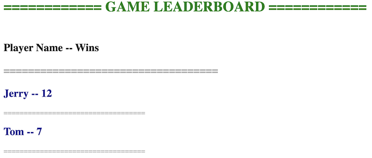

# War Game

## Introduction
An RESTful app that demonstrate two bot players plays the card game of War. User are provided with two endpoints to interact with:

	* An endpoint to start a game. Two simulated players will play out the game.
	* An endpoint to get lifetime wins for each player stored in a database.

## Game Background
Introduction of the Card game of [War](https://en.wikipedia.org/wiki/War_(card_game))
The implementation of this game is following the rules [here](https://bicyclecards.com/how-to-play/war/)

## Dependencies
* `Python 3.8.16`
* `Flask 2.2.2`
* `firebase_admin 6.1.0`

## Instruction
1. Use `git clone` command to create a copy of the repository on your local machine. 
2. Run command `docker build -t war-game .` at the root directory of this project to build a docker image from the Dockerfile
3. Run command `docker run -p 8999:5000 war-game` to start the War Game application
4. The web application can be access through [http://localhost:8099/](http://localhost:8099/)

## API Endpoint
This application provided two API endpoint, where one endpoint is to start a game and another endpoint is to view the leaderboard.  
* Start a game:  
	* Start game with default players: http://localhost:8099/start-game
	* Start game with customized players:
		- http://localhost:8099/start-game/<player_1>
		- http://localhost:8099/start-game/<player_1>/<player_2>
* View the leaderboard:
	* http://localhost:8099/leaderboard
	
## Demo
* Game interface:
    Once a new game started, it will show the whole game log on the page
    * Here is an example of a singe round of the game:
    

    This log shows that Tom has 27 cards on his hand while Jerry has 23 cards on his hand.
    The number of cards on table is 2.  
    * Here is an example of a round when WAR is occurred:
    
    
    When the war is initialized, two players stay in the same round while putting a new card face down
    on the table and compare the next card. Now there are 6 cards on the table.
    * Here is an example of the leaderboard:
    
    
    When entering the leaderboard page, the page will display all the players lifetime wins ordered a form of leaderboard.

